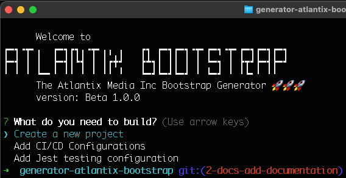
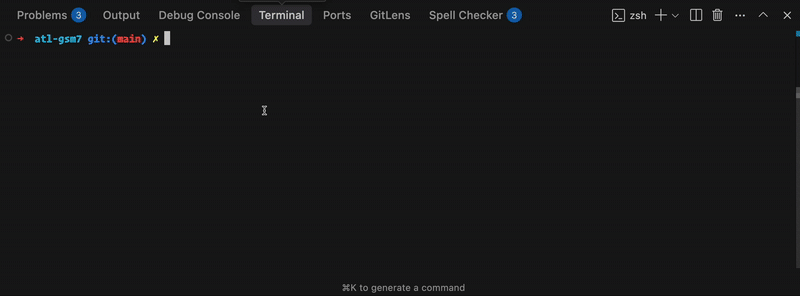

## Atlantix Bootstrap 🚀🚀🚀
This is a tool that will help us automatically generate projects structures based on templates.
You will be able to:

* 🗃️ Create new [Nextjs](https://nextjs.org/) projects based on our coding standards
* ✈️ Add CI/CD in existing node projects
* 🧪 Add testing with [Jest](https://jestjs.io/) in existing projects

And more...

 

This project was build under the architecture of [yeoman](https://yeoman.io/) and it works as a global 
dependency that can be used in any of our projects.

## Usage 🚚
In order to start using the generator. You will have to install:

1- [yeoman](https://yeoman.io/) generator globally
```cmd
npm install -g yo
```

2- Atlantix Bootstrap Generator
```cmd
npm i generator-atlantix-bootstrap
```

Finally, you can start using the generator. Just like this:
```cmd
yo atlantix-bootstrap
```
 

That's it.

This project is published in [npm](https://www.npmjs.com/package/generator-atlantix-bootstrap)

## About 🧑‍💻
This repository is maintained by everyone at [Atlantix Media Inc](https://github.com/Atlantix-Media-Inc).
